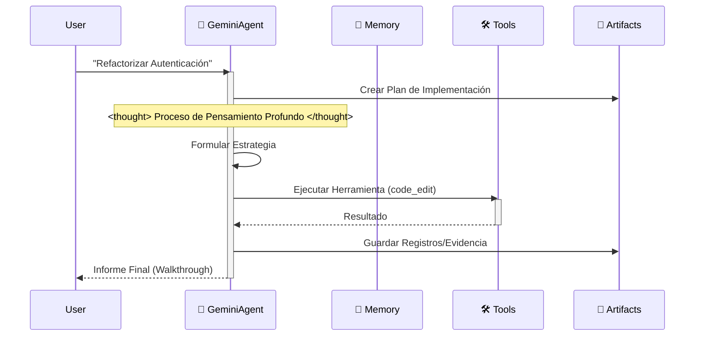
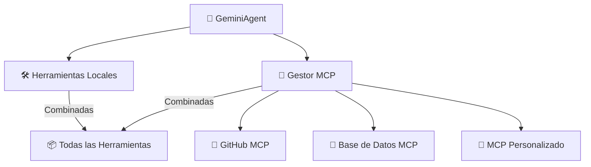
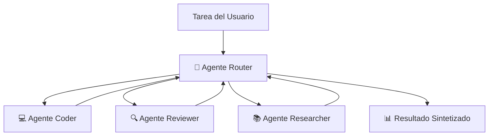

# 🪐 Plantilla de Espacio de Trabajo Google Antigravity (Edición Empresarial)
Idiomas: [English](README.md) | [中文](README_CN.md) | [Español](README_ES.md)


Bienvenido a la **Plantilla de Espacio de Trabajo Antigravity**. Es un kit de inicio de nivel producción para construir agentes autónomos en la plataforma Google Antigravity, totalmente alineado con la **Documentación Oficial de Antigravity** y orgullosamente “Anti-LangChain” por su arquitectura mínima y transparente.


## 🌟 Filosofía del Proyecto

En una era rica en IDEs de IA, quería lograr una arquitectura de nivel empresarial con solo **Clonar -> Renombrar -> Prompt**.

Este proyecto aprovecha la conciencia del contexto del IDE (a través de `.cursorrules` y `.antigravity/rules.md`) para incrustar una **Arquitectura Cognitiva** completa directamente en los archivos del proyecto.

Cuando abres este proyecto, tu IDE ya no es solo un editor; se transforma en un **Arquitecto "Conocedor"**.

### ¿Por qué necesitamos un Andamiaje "Pensante"?

Al usar Google Antigravity o Cursor para el desarrollo de IA, encontré un punto débil:

**Los IDEs y los modelos son poderosos, pero los "proyectos vacíos" son débiles.**

Cada vez que iniciamos un nuevo proyecto, repetimos configuraciones aburridas:
- "¿Debería ir mi código en src o app?"
- "¿Cómo defino las funciones de herramientas para que Gemini las reconozca?"
- "¿Cómo hago que la IA recuerde el contexto?"

Este trabajo repetitivo es un desperdicio de creatividad. Mi flujo de trabajo ideal es: **Git Clone -> El IDE ya sabe qué hacer.**

Por eso creé este proyecto: **Antigravity Workspace Template**.

## 🧠 Filosofía Central: Artifact-First (Artefacto-Primero)

Este espacio de trabajo impone el protocolo **Artifact-First**. El Agente no solo escribe código; produce artefactos tangibles para cada tarea compleja.

1. **Planificación**: Se crea `artifacts/plan_[task_id].md` antes de codificar.
2. **Evidencia**: Los registros y salidas se guardan en `artifacts/logs/`.
3. **Visuales**: Los cambios de UI generan capturas como artefactos.

## 🛸 Cómo Funciona

El agente sigue un bucle estricto de “Pensar-Actuar-Reflexionar”, simulando el proceso cognitivo de Gemini 3.



## 🔥 Funciones Asesinas

- 🧠 **Motor de Memoria Infinita**: La resumición recursiva comprime el historial automáticamente; los límites de contexto dejan de ser un problema.
- 🛠️ **Protocolo Universal de Herramientas**: Patrón ReAct genérico. Registra cualquier función de Python en `available_tools` y el Agente sabrá usarla.
- ⚡️ **Nativo de Gemini**: Optimizado para la velocidad y las llamadas a funciones de Gemini 2.0 Flash.
- 🔌 **LLM externo (compatible OpenAI)**: Usa la herramienta `call_openai_chat` para llamar cualquier endpoint formato OpenAI (OpenAI/Azure/Ollama).

## 🚀 Inicio Rápido

### Desarrollo Local
1. **Instalar dependencias**:
    ```bash
    pip install -r requirements.txt
    ```
2. **Ejecutar el Agente**:
    ```bash
    python src/agent.py
    ```

### Despliegue con Docker
1. **Construir y ejecutar**:
    ```bash
    docker-compose up --build
    ```

## 📂 Estructura del Proyecto

```
.
├── .antigravity/       # 🛸 Configuración Oficial de Antigravity
│  └── rules.md        # Reglas y Permisos del Agente
├── artifacts/          # 📂 Salidas del Agente (Planes, Registros, Visuales)
├── .context/           # Base de Conocimiento de IA
├── .github/            # Flujos de Trabajo CI/CD
├── src/                # Código Fuente
│  ├── agent.py        # Lógica Principal del Agente
│  ├── config.py       # Gestión de Configuraciones
│  ├── memory.py       # Gestor de Memoria JSON
│  └── tools/          # Herramientas del Agente
├── tests/              # Suite de Pruebas
├── .cursorrules        # Puntero de Compatibilidad
├── Dockerfile          # Construcción de Producción
├── docker-compose.yml  # Configuración de Desarrollo Local
└── mission.md          # Objetivo del Agente
```

## 🚀 Flujo de Trabajo “Cero-Configuración”

Deja de escribir largos prompts del sistema. Este espacio de trabajo precarga la arquitectura cognitiva de la IA por ti.

### Paso 1: Clonar y Renombrar (El “Molde”)
Trata este repositorio como un molde de fábrica. Clónalo y renombra la carpeta con el nombre de tu proyecto.
```bash
git clone https://github.com/study8677/antigravity-workspace-template.git my-agent-project
cd my-agent-project
# Ahora estás listo. No se requiere configuración.
```

### Paso 2: El Momento Mágico ⚡️
Abre la carpeta en Cursor o Google Antigravity.
- 👀 **Observa**: El IDE detecta automáticamente `.cursorrules`.
- 🧠 **Carga**: La IA ingiere silenciosamente la personalidad “Experto en Antigravity” desde `.antigravity/rules.md`.

### Paso 3: Solo Pregunta (Sin Instrucciones Extras)
No necesitas decirle a la IA que “tenga cuidado” o “use la carpeta src”. Ya está programada para ser un Ingeniero Senior.

**Forma Antigua (Prompting Manual)**:
> “Por favor escribe un juego de la serpiente. Asegúrate de usar código modular. Pon los archivos en src. No olvides los comentarios…”

**La Forma Antigravity**:
> “Construye un juego de la serpiente.”

La IA automáticamente:
1. 🛑 **Pausa**: “Según los protocolos, debo planificar primero.”
2. 📄 **Documenta**: Genera `artifacts/plan_snake.md`.
3. 🔨 **Construye**: Escribe código modular en `src/game/` con docstrings completos estilo Google.

## 🗺️ Hoja de Ruta

- [x] **Fase 1: Fundación** (Andamiaje, Configuración, Memoria)
- [x] **Fase 2: DevOps** (Docker, CI/CD)
- [x] **Fase 3: Cumplimiento Antigravity** (Reglas, Artefactos)
- [x] **Fase 4: Memoria Avanzada** (Búfer de Resumen Implementado ✅)
- [x] **Fase 5: Arquitectura Cognitiva** (Despacho de Herramientas Genérico Implementado ✅)
- [x] **Fase 6: Descubrimiento Dinámico** (Carga Automática de Herramientas y Contexto ✅)
- [x] **Fase 7: Enjambre Multi-Agente** (Orquestación Router-Worker ✅)
- [x] **Fase 8: Integración MCP** (Model Context Protocol ✅) - *Implementado por [@devalexanderdaza](https://github.com/devalexanderdaza)*
- [ ] **Fase 9: Núcleo Empresarial** (La Visión "Agent OS")
  - [ ] **Entorno Sandbox**: Ejecución segura de código (ej. E2B o Docker local) para operaciones de alto riesgo.
  - [ ] **Flujos Orquestados**: Tuberías de ejecución estructuradas y paralelas (DAGs) para tareas complejas.

## 🔌 Nuevo: Integración MCP (Model Context Protocol)

**Conecta cualquier servidor MCP.** El agente soporta el [Model Context Protocol](https://modelcontextprotocol.io/) para integrar herramientas y datos externos de forma transparente.

### 🌐 ¿Qué es MCP?

MCP estandariza cómo las apps de IA acceden a herramientas/servicios externos. Con MCP, tu agente puede:

- 🔗 Conectar múltiples servidores MCP en paralelo.
- 🛠️ Usar cualquier herramienta expuesta por esos servidores.
- 📊 Acceder a bases de datos, APIs, sistemas de archivos, navegadores, etc.
- 🔄 Unificar herramientas locales y remotas sin cambios en tu código.

### 🚀 Configuración Rápida

1. **Activa MCP en tu `.env`:**
    ```bash
    MCP_ENABLED=true
    ```
2. **Configura servidores en `mcp_servers.json`:**
    ```json
    {
      "servers": [
        {
          "name": "github",
          "transport": "stdio",
          "command": "npx",
          "args": ["-y", "@modelcontextprotocol/server-github"],
          "enabled": true,
          "env": {
            "GITHUB_PERSONAL_ACCESS_TOKEN": "${GITHUB_TOKEN}"
          }
        }
      ]
    }
    ```
3. **Ejecuta el agente:**
    ```bash
    python src/agent.py
    ```

El agente automáticamente:
- 🔌 Se conecta a los servidores MCP configurados.
- 🔍 Descubre las herramientas disponibles.
- 📦 Las fusiona con las herramientas locales.

### 🏗️ Arquitectura



### 📡 Transportes Soportados

| Transporte | Descripción | Caso de uso |
|-----------|-------------|-------------|
| `stdio` | Entrada/Salida estándar | Servidores locales, CLIs |
| `http` | HTTP con streaming | Servidores remotos, servicios en nube |
| `sse` | Server-Sent Events | Servidores HTTP legacy |

### 🛠️ Herramientas Auxiliares MCP

Incluidas en el agente para gestionar MCP:

- `list_mcp_servers()` — Lista servidores conectados.
- `list_mcp_tools()` — Enumera herramientas disponibles.
- `get_mcp_tool_help("<tool>")` — Muestra ayuda de una herramienta MCP.
- `mcp_health_check()` — Verifica salud de servidores.

### 📋 Servidores Preconfigurados

`mcp_servers.json` incluye plantillas listas para usar:

- 🗂️ **Filesystem**
- 🐙 **GitHub**
- 🗃️ **PostgreSQL**
- 🔍 **Brave Search**
- 💾 **Memory**
- 🌐 **Puppeteer**
- 💬 **Slack**

Activa los que necesites y agrega tus llaves API.

### 🔧 Crear tu propio Servidor MCP

Ejemplo con el [SDK Python de MCP](https://github.com/modelcontextprotocol/python-sdk) usando FastMCP:

```python
from mcp.server.fastmcp import FastMCP

mcp = FastMCP("Mi Servidor Personalizado")

@mcp.tool()
def mi_herramienta(param: str) -> str:
    """Una herramienta personalizada."""
    return f"Procesado: {param}"

if __name__ == "__main__":
    mcp.run()
```

Regístralo en `mcp_servers.json`:

```json
{
  "name": "mi-servidor",
  "transport": "stdio",
  "command": "python",
  "args": ["ruta/a/mi_servidor.py"],
  "enabled": true
}
```

## 🌐 Nuevo: LLM externo (compatible OpenAI)

Usa cualquier endpoint de chat tipo OpenAI (OpenAI, Azure OpenAI, Ollama, etc.) para dirigir el agente con una API unificada.

1) Configura variables de entorno:
```bash
OPENAI_BASE_URL=https://api.openai.com/v1   # o http://localhost:11434/v1 para Ollama u otro endpoint OpenAI-compatible
OPENAI_API_KEY=sk-...                       # déjalo vacío si el endpoint no requiere clave
OPENAI_MODEL=gpt-4o-mini                    # o el modelo que prefieras
```
2) Herramienta: `call_openai_chat` (args: prompt, system, opcional model/temperature/max_tokens).
3) Comportamiento: sigue el esquema estándar `/chat/completions` y devuelve el texto del primer choice o un mensaje de error.

## 🔥 Nuevo: Carga de Herramientas y Contexto Cero-Config

**Sin imports manuales.** El agente descubre y carga automáticamente herramientas y conocimiento.

### 🛠️ Descubrimiento Automático de Herramientas
Coloca cualquier archivo Python en `src/tools/` y el agente lo sabrá usar de inmediato:

```python
# src/tools/mi_herramienta.py
def analizar_sentimiento(texto: str) -> str:
    """Analiza el sentimiento del texto."""
    return "Sentimiento positivo detectado"
```

Reinicia y la herramienta estará disponible sin tocar `agent.py`.

### 📚 Carga Automática de Contexto
Agrega conocimiento a `.context/` y se inyecta automáticamente:

```bash
echo "# Reglas del Proyecto
Usa lenguaje claro." > .context/reglas_proyecto.md
```

El agente seguirá estas reglas en la siguiente ejecución.

## 🔥 Nuevo: Protocolo de Enjambre Multi-Agente

**Colabora a escala.** El enjambre permite múltiples agentes especialistas trabajando coordinados.

### 🪐 Arquitectura: Patrón Router-Worker



**Agentes Especialistas:**
- **Router**: Analiza, delega y sintetiza.
- **Coder**: Escribe código limpio y documentado.
- **Reviewer**: Revisa calidad, seguridad y buenas prácticas.
- **Researcher**: Investiga y reúne información.

### 🚀 Uso

**Demo interactiva:**
```bash
python -m src.swarm_demo
```

**En tu código:**
```python
from src.swarm import SwarmOrchestrator

swarm = SwarmOrchestrator()
resultado = swarm.execute("Construye una calculadora y revísala por seguridad")
print(resultado)
```

**Salida de ejemplo:**
```
🧭 [Router] Analizando tarea...
📤 [Router → Coder] Construir calculadora
💻 [Coder] Creando implementación...
✅ [Coder] ¡Listo!
📤 [Router → Reviewer] Revisar seguridad
🔍 [Reviewer] Analizando código...
✅ [Reviewer] Revisión completa
🎉 ¡Tarea completada!
```

## 👥 Colaboradores

Un agradecimiento especial a los miembros de la comunidad que han contribuido a este proyecto:

- [@devalexanderdaza](https://github.com/devalexanderdaza) 💻 🧠 **(¡Primer Colaborador!)**
  - Implementó scripts de herramientas de demostración y mejoró la funcionalidad del agente.
  - Propuso el **Roadmap "Agent OS"** (MCP, Sandbox, Orquestación).
  - Completó la configuración de MCP
- [@Subham-KRLX](https://github.com/Subham-KRLX) 💻
  - Se agregaron herramientas dinámicas y carga de contexto (Arregla #4)
  - Nueva característica: Agregar protocolo de clúster multi-agente (Arregla #6)

**¿Quieres contribuir?** ¡Revisa nuestra página de [Issues](https://github.com/study8677/antigravity-workspace-template/issues)!

## ⭐ Star History

[](https://star-history.com/#study8677/antigravity-workspace-template&Date)

## 💡 Llamada a Ideas: Núcleo Empresarial

Valoramos las **ideas** tanto como el código. El foco ahora es la **Fase 9: Núcleo Empresarial** (sandbox seguro y flujos orquestados). Si propones una arquitectura o diseño adoptable, **te añadiremos como colaborador**.

Comparte tus pensamientos en los [Issues](https://github.com/study8677/antigravity-workspace-template/issues), incluso si no tienes tiempo para escribir la implementación.

